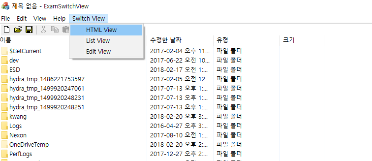
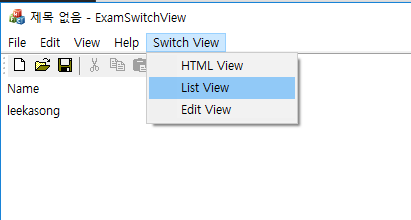
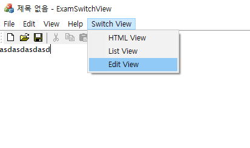

# 스위치 뷰

  

    

* MainFrame에 뷰 클래스 선언
* OnCreateClient()에 뷰 클래스 생성
* SwitchView() 함수 MainFrame에 추가
* 메뉴 리소스를 수정해서 핸들러 추가

### 코드  

* 여기서 중요한 것은 액티브되는 뷰는 반드시 ID로 AFX_IDW_PANE_FIRST를 가져야 한다는 것이다.

```
void CMainFrame::SwitchView(int nID)
{
	CView *pOldView = GetActiveView();
	CView *pNewView = NULL;

	switch (nID) {
	case VIEWID_HTML:
		pNewView = (CView *)m_pWndHtmlView;
		break;
	case VIEWID_EDIT:
		pNewView = (CView *)m_pWndEditView;
		break;
	case VIEWID_LIST:
		pNewView = (CView *)m_pWndListView;
		break;
	}

	if (pNewView) {
		if (pOldView == pNewView) return;

		pOldView->ShowWindow(SW_HIDE);
		pOldView->SetDlgCtrlID(nID);

		pNewView->SetDlgCtrlID(AFX_IDW_PANE_FIRST);
		pNewView->ShowWindow(SW_SHOW);
		SetActiveView(pNewView);
		RecalcLayout();
	}
}
```


#### reference
Visual C++ 2008 MFC 윈도우 프로그래밍
