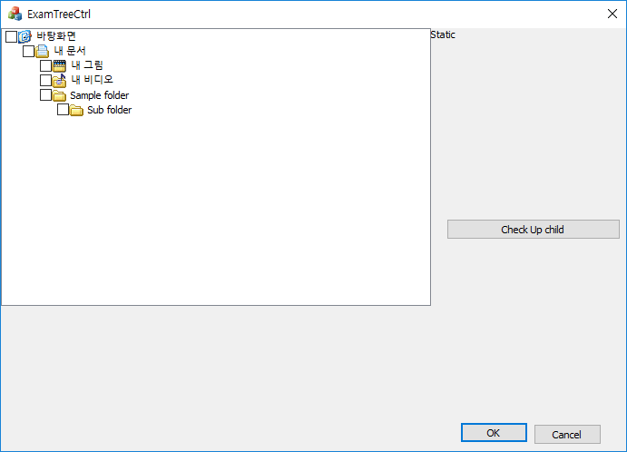
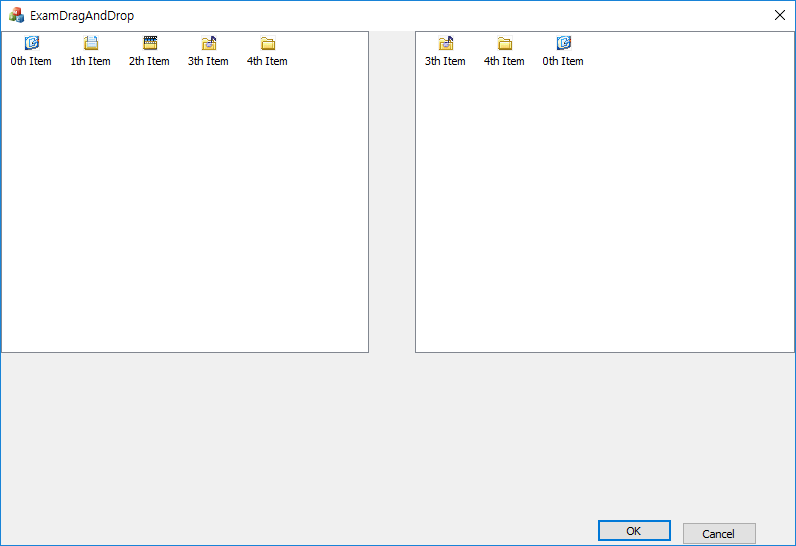

# Tree control

### 기본적인 제어
```
void CExamTreeCtrlDlg::initTreeCtrl()
{
	CBitmap bmp;
	bmp.LoadBitmapW(IDB_BITMAP1);
	m_image_list.Create(16, 16, ILC_COLOR24, 6, 0);
	m_image_list.Add(&bmp, RGB(255, 0, 0));
	m_tree.SetImageList(&m_image_list, TVSIL_NORMAL);

	HTREEITEM hItem;
	hItem = m_tree.InsertItem(_T("바탕화면"), 0, 0, TVI_ROOT);
	hItem = m_tree.InsertItem(_T("내 문서"), 1, 5, hItem);
	m_tree.InsertItem(_T("내 그림"), 2, 5, hItem);
	m_tree.InsertItem(_T("내 비디오"), 3, 5, hItem);
	hItem = m_tree.InsertItem(_T("Sample folder"), 4, 5, hItem);
	hItem = m_tree.InsertItem(_T("Sub folder"), 4, 5, hItem);

	m_tree.EnsureVisible(hItem);

}


void CExamTreeCtrlDlg::OnTvnSelchangedTree1(NMHDR *pNMHDR, LRESULT *pResult)
{
	LPNMTREEVIEW pNMTreeView = reinterpret_cast<LPNMTREEVIEW>(pNMHDR);

	CString str = m_tree.GetItemText(pNMTreeView->itemNew.hItem);
	GetDlgItem(IDC_STATIC)->SetWindowTextW(str);
	*pResult = 0;
}


void CExamTreeCtrlDlg::OnBnClickedButton1()
{
	HTREEITEM hItem = m_tree.GetRootItem();
	if (m_tree.GetCheck(hItem)) {
		AfxMessageBox(m_tree.GetItemText(hItem));
	}
	CheckupChild(m_tree.GetRootItem());
}

void CExamTreeCtrlDlg::CheckupChild(HTREEITEM hItem) {
	HTREEITEM hChildItem = m_tree.GetChildItem(hItem);
	while (hChildItem != NULL) {
		if (m_tree.GetCheck(hChildItem)) {
			AfxMessageBox(m_tree.GetItemText(hChildItem));
		}
		if (m_tree.ItemHasChildren(hChildItem)) CheckupChild(hChildItem);

		hChildItem = m_tree.GetNextItem(hChildItem, TVGN_NEXT);


	}
}
```
* 트리컨트롤이기 때문에, 전체 조회할 때는 재귀적으로 접근해야한다.



### 드래그앤드랍
```
BOOL CExamDragAndDropDlg::OnInitDialog()
{
	CDialogEx::OnInitDialog();

	// Set the icon for this dialog.  The framework does this automatically
	//  when the application's main window is not a dialog
	SetIcon(m_hIcon, TRUE);			// Set big icon
	SetIcon(m_hIcon, FALSE);		// Set small icon

	CBitmap bmp;
	bmp.LoadBitmapW(IDB_BITMAP1);
	m_baseImageList.Create(16, 16, ILC_COLOR32 | ILC_MASK, 5, 0);
	m_baseImageList.Add(&bmp, RGB(0, 0, 0));
	m_left_list.SetImageList(&m_baseImageList, LVSIL_NORMAL);
	m_right_list.SetImageList(&m_baseImageList, LVSIL_NORMAL);

	CString str;
	for (int i = 0; i < 5; i++) {
		str.Format(_T("%dth Item"), i);
		m_left_list.InsertItem(i, str, i);
	}

	DWORD dwExStyle = m_left_list.GetExtendedStyle();
	m_left_list.SetExtendedStyle(dwExStyle | LVS_EX_BORDERSELECT);
	dwExStyle = m_right_list.GetExtendedStyle();
	m_right_list.SetExtendedStyle(dwExStyle | LVS_EX_BORDERSELECT);

	return TRUE;  // return TRUE  unless you set the focus to a control
}

void CExamDragAndDropDlg::OnLvnBegindragList1(NMHDR *pNMHDR, LRESULT *pResult)
{
	LPNMLISTVIEW pNMLV = reinterpret_cast<LPNMLISTVIEW>(pNMHDR);

	CPoint ptDrag, ptAction;
	m_selected_index = pNMLV->iItem;
	mp_image_list = m_left_list.CreateDragImage(pNMLV->iItem, &ptDrag);
	mp_image_list->SetBkColor(RGB(0, 0, 0));
	ptAction = pNMLV->ptAction;


	SetCapture();
	mp_image_list->BeginDrag(0, ptAction - ptDrag);
	m_left_list.ClientToScreen(&ptAction);
	mp_image_list->DragEnter(NULL, ptAction);
	*pResult = 0;
}


void CExamDragAndDropDlg::OnMouseMove(UINT nFlags, CPoint point)
{
	if (mp_image_list != NULL) {
		ClientToScreen(&point);
		CWnd *p_wnd = WindowFromPoint(point);
		if (p_wnd) {
			if (this == p_wnd || IsChild(p_wnd)) {
				mp_image_list->DragEnter(NULL, point);
				mp_image_list->DragMove(point);
			}
			else {
				mp_image_list->DragLeave(NULL);
			}
		}
	}

	CDialogEx::OnMouseMove(nFlags, point);
}


void CExamDragAndDropDlg::OnLButtonUp(UINT nFlags, CPoint point)
{
	CString str;
	if (mp_image_list) {
		ClientToScreen(&point);

		mp_image_list->DragLeave(NULL);
		mp_image_list->EndDrag();
		ReleaseCapture();

		CWnd *p_wnd = WindowFromPoint(point);
		if (p_wnd == &m_right_list && m_selected_index >= 0) {
			LVITEM lvItem;
			TCHAR szBuffer[256] = { 0, };
			::ZeroMemory(&lvItem, sizeof(LVITEM));

			lvItem.mask = LVIF_TEXT | LVIF_IMAGE;
			lvItem.iItem = m_selected_index;
			lvItem.pszText = szBuffer;
			lvItem.cchTextMax = 256;
			m_left_list.GetItem(&lvItem);

			m_right_list.InsertItem(0, lvItem.pszText, lvItem.iImage);
		}
		else {
			m_left_list.ScreenToClient(&point);
			int nIndex = m_left_list.HitTest(point);
			if (nIndex >= 0) {
				str.Format(_T("Drop on %dth item"), nIndex);
				AfxMessageBox(str);
			}
		}

		delete mp_image_list;
		mp_image_list = NULL;
		m_selected_index = -1;
	}

	CDialogEx::OnLButtonUp(nFlags, point);
}
```

* ILC_MASK는 이미지리스트는 백그라운드 이미지로 사용되는 비트맵이 존재하는데, 이 매크로를 설정하면 백그라운드 비트맵(기본은 검정)을 사용하지 않는다. 즉 투명한 배경이 된다.
* OnLvnBegindragList1()에서는 리스트뷰 항목 클릭시 발생. 드래그시 표시할 이미지를 만든다.
* 윈도우 밖을 나가게 되면 드래그가 허용이 되지 않기 때문에, DragLeave() 호출하여 마우스를 자유롭게 둔다.
* 다시 들어왔을 때 드래그를 유지시키고 싶을 경우, 이전에 DragEnter()에서 전달했던 인자와 동일한 핸들을 넘겨줘야 한다.
* GetItem()으로 인덱스에 해당하는 노드를 찾고, 정보를 저장한다. 그 정보를 바탕으로 목적지 리스트뷰에 동일한 노드를 만든다.
* HitTest()는 명시한 위치에 노드가 있을 경우 해당 인덱스를 반환한다.




#### reference
Visual C++ 2008 MFC 윈도우 프로그래밍
