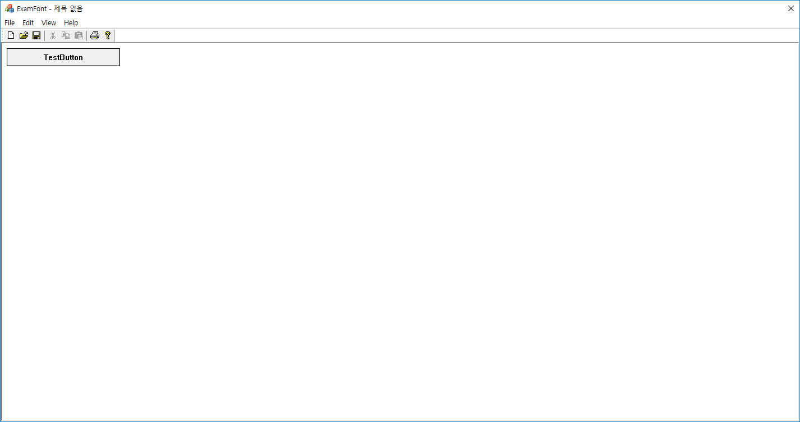

# 버튼 컨트롤 직접 구현하기

```
void CExamFontView::OnPaint()
{
	CPaintDC dc(this); // device context for painting
	CRect rect(m_BtnRect);
	rect += CRect(1, 1, 1, 1);
	dc.Rectangle(&rect);
	dc.FillSolidRect(&m_BtnRect, ::GetSysColor(COLOR_BTNFACE));

	if (m_bClicked) {
		dc.Draw3dRect(&m_BtnRect,::GetSysColor(COLOR_3DSHADOW),::GetSysColor(COLOR_3DLIGHT));
	}
	else {
		dc.Draw3dRect(&m_BtnRect, ::GetSysColor(COLOR_3DLIGHT), ::GetSysColor(COLOR_3DSHADOW));
	}

	dc.SetBkColor(::GetSysColor(COLOR_BTNFACE));
	dc.SetTextColor(::GetSysColor(COLOR_BTNTEXT));

	if (m_bClicked) {
		rect += CRect(0, 0, 2, 2);
		dc.DrawText(_T("TestButton"), &rect, DT_CENTER | DT_SINGLELINE | DT_VCENTER);
	}
	else {
		dc.DrawText(_T("TestButton"), &m_BtnRect, DT_CENTER | DT_SINGLELINE | DT_VCENTER);
	}
}


void CExamFontView::OnLButtonDown(UINT nFlags, CPoint point)
{
	if (m_BtnRect.PtInRect(point)) {
		m_bClicked = !m_bClicked;
		RedrawWindow(&m_BtnRect);
	}

	CView::OnLButtonDown(nFlags, point);
}


void CExamFontView::OnLButtonUp(UINT nFlags, CPoint point)
{
	if (m_bClicked) {
		m_bClicked = !m_bClicked;
		RedrawWindow(&m_BtnRect);
		if (m_BtnRect.PtInRect(point)) {
			AfxMessageBox(_T("버튼클릭!"));
		}
	}

	CView::OnLButtonUp(nFlags, point);
}
```

* Draw3dRect()은 볼록나오게 보이거나, 오목하게 보이도록 그릴 수 있게 한다.

#### reference
Visual C++ 2008 MFC 윈도우 프로그래밍
