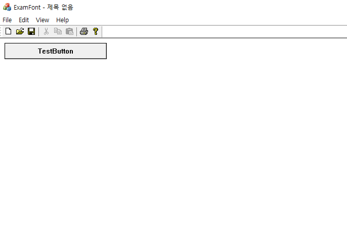

# Font

```
void CExamFontView::OnPaint()
{
	CPaintDC dc(this); // device context for painting
	int ny = 0;
	CFont font;
	CFont *p_old_font;

	LOGFONT lf;
	::ZeroMemory(&lf, sizeof(lf));
	wsprintf(lf.lfFaceName, _T("%s"), _T("Arial"));

	for (int i = 10; i < 25; i++) {
		lf.lfHeight = i;
		ny += i;

		font.CreateFontIndirectW(&lf);
		p_old_font = dc.SelectObject(&font);
		dc.TextOutW(10, ny, _T("Test String"));
		dc.SelectObject(&font);

		font.DeleteObject();
	}
}
```
  
* 폰트의 설정을 바꾸고 싶다면, LOGFONT 구조체에서 적절히 설정
* 운영체제가 지원하는 폰트체를 알고 싶다면, EnumFont() 함수를 사용

#### TextOut()
TextOut() 함수는 탭키를 적용하지 않기 때문에, 탭키를 통해 공백을 주기 위해선 TappedTextOut() 함수를 사용해야 한다.

#### reference
Visual C++ 2008 MFC 윈도우 프로그래밍
