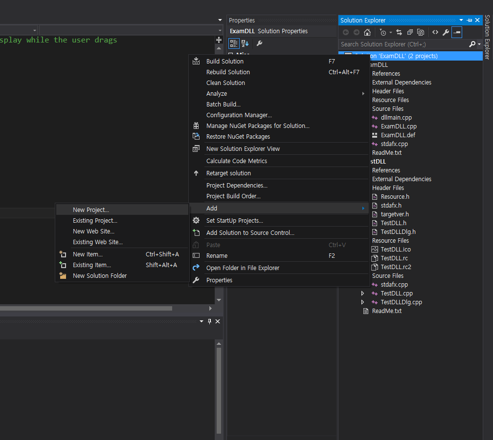

# Implicit DLL (암시적 DLL)


* PE헤더에 DLL에 대한 정보를 담는다.
* DLL에 있는 함수를 사용할 때, 운영체제는 PE 헤더에 있는 DLL 정보를 보고 해당 함수를 호출한다.

  

  


* 아래와 같이 참조할 함수를 작성해준다. 그리고 빌드한다.

  


```
__declspec(dllexport)
BOOL WINAPI GetModulePath(CString& strPath) {
	TCHAR szBuffer[MAX_PATH] = { 0, };
	::GetModuleFileName(NULL, szBuffer, MAX_PATH);

	for (int i = lstrlen(szBuffer) - 1; i >= 0; i--) {
		if (szBuffer[i] == '\\') {
			int j = lstrlen(szBuffer) - 1;
			for (; j >= i; j--) {
				szBuffer[j] = NULL;
			}

			if (szBuffer[j] == ':') szBuffer[j + 1] = '\\';

			strPath = szBuffer;
			return TRUE;
		}
	}

	return FALSE;
}
```

* DLL을 사용할 프로젝트 만들기  

  

* 빌드시 생성되는 lib 파일을 복사한다.  

  

* stdafx.h에 아래와 같은 코드를 작성한다.

  


```
__declspec(dllimport)BOOL WINAPI GetModulePath(CString& strPath);
#pragma comment(lib, "ExamDLL")
```  

* 중요한 것은 함수의 선언과 링크를 명시해야 하는 점이다. 당연히 해당 함수가 있는 헤더파일 인클루드해도 된다.

* 함수를 사용한다.  

  

### explicit DLL도 지원해야 할 때  

* 암시적 DLL만 지원해도 되는 경우면 위의 코드대로 해도 괜찮으나, 명시적 DLL로도 가능하게끔 DLL 파일을 제공해야 한다면 \__declspec(dllimport)와 같은 코드 때문에 오류가 나게 됩니다.
* 따라서 \__declspec(dllimport)를 지우고, dll의 .def 파일에서 아래와 같이 수정합니다.

  

#### reference
Visual C++ 2008 MFC 윈도우 프로그래밍
