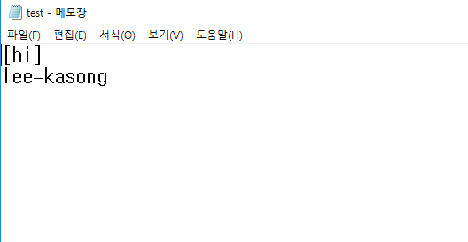

# ini 파일 다루기

누가 봐도 설정 파일 같이 생긴 ini 파일이다.  
  
  

### ini 파일 쓰기
```
void CExamRegistryDlg::OnBnClickedButton1()
{
	WritePrivateProfileString(_T("hi"), _T("lee"), _T("kasong"), path);
}
```

### ini 파일 읽기
```
void CExamRegistryDlg::OnBnClickedButton2()
{
	TCHAR buf[1024] = { 0, };
	GetPrivateProfileString(_T("hi"), _T("lee"), _T("asdasd"), buf, _tcslen(_T("kasong")) + 1, path);
	AfxMessageBox(buf);
}
```

#### reference
http://blog.naver.com/PostView.nhn?blogId=hji0223&logNo=220541951375&parentCategoryNo=&categoryNo=&viewDate=&isShowPopularPosts=false&from=postView
